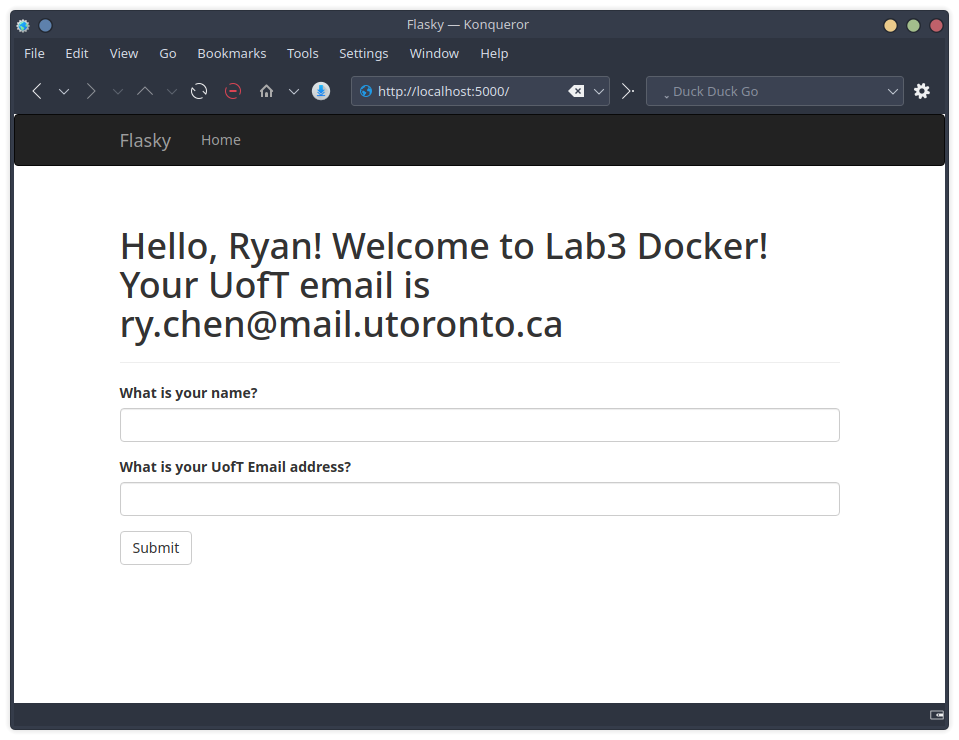

# Ryan Chen
this repo is a clone of https://github.com/miguelgrinberg/flasky

the .gitignore file was sourced from https://github.com/github/gitignore/blob/main/Python.gitignore

# Activity 1

# Activity 2

# Activity 3 

# Activity 4

Changed browser from Firefox to Konquerer, because issues with Spectacle's active window capture mode and wtform field error popups closing before capture, formatting of error popup also differed from lab instructions: presenting "please enter an email address" instead of the expected error message. This may be a result of Firefox plugins, customized setting configuration, or just specific Firefox-wtform interaction. Willing to demonstrate issue in assigned practical time for further investigation. Konquerer will be used from now on for all ECE444 web-based content for individual assessment.

